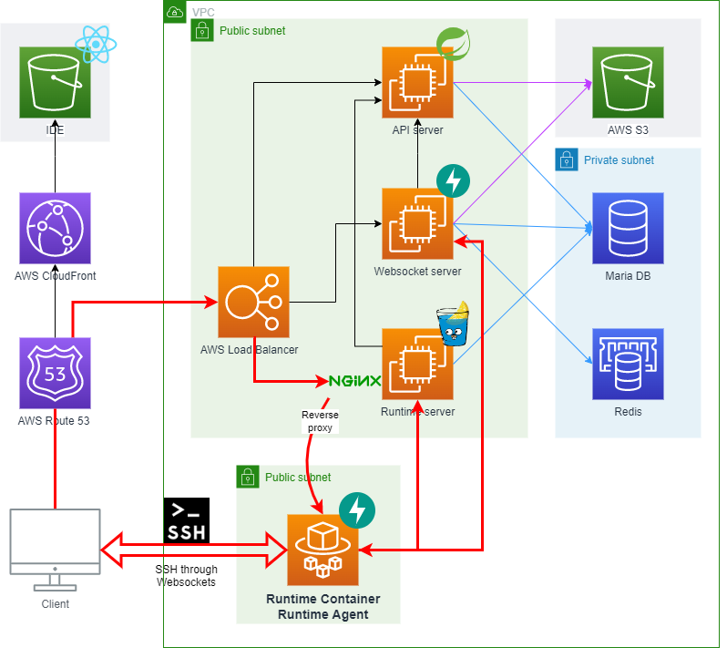
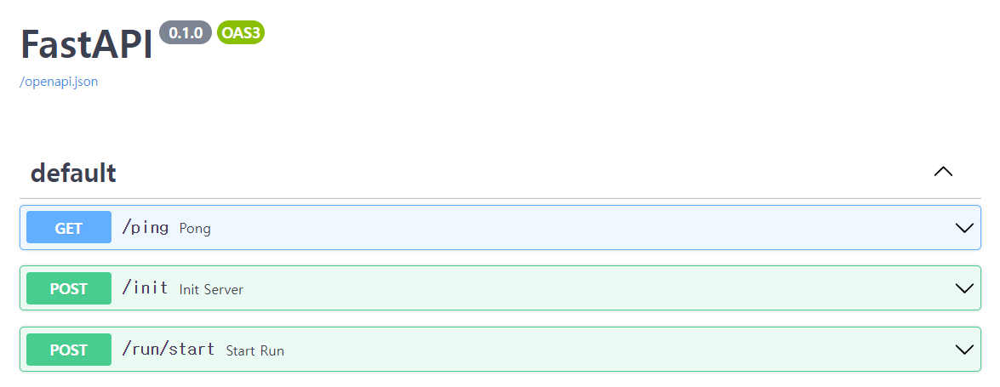

# Runtime-Agent

**Runtime-Agent** runs in a [Runtime-Container](https://github.com/Together-Coding/Runtime-Container) to initialize its machine and to link a user in [web IDE](https://github.com/Together-Coding/Client) with a terminal of the container.
It also prepares for code execution by downloading project code from [IDE server](https://github.com/Together-Coding/IDE-server).

## What it does

- When [Runtime-Container](https://github.com/Together-Coding/Runtime-Container) is launched and this server is up, it is assigned a unique API key from [Runtime-Bridge](https://github.com/Together-Coding/Runtime-Bridge) and creates random password used for SSH connection.
- It creates local SSH connection, and forwards messages from the user in web IDE to SSH and vice versa.
- It prepares for code execution by downloading project code from [IDE server](https://github.com/Together-Coding/IDE-server) into its local directory.

## Requirements

- Python 3.6 to 3.9  
    > version 3.10 or newer is not allowed because this runs in [runtime-containers](https://github.com/Together-Coding/runtime-container). Especially, GCC container has python 3.9.

## Development
- Install packages  
    `$ pip install -r requirements.txt`
- Start server  
    `$ DEBUG=true uvicorn agent:app --reload`

## Deployment

There is no need to deploy directly. Runtime-Agent runs inside of [Runtime-Container](https://github.com/Together-Coding/Runtime-Container).
All you have to do is specify the version of the commit hash you want to use in `Dockerfile`s of runtime-container.

## API Document

API documents can be found here: http://localhost:8000/docs.

They are generated by [swagger](https://github.com/swagger-api/swagger-ui) integrated into FastAPI. 
It automatically updates documents whenever you modify your code. See more details from [here](https://fastapi.tiangolo.com/features/#automatic-docs).

